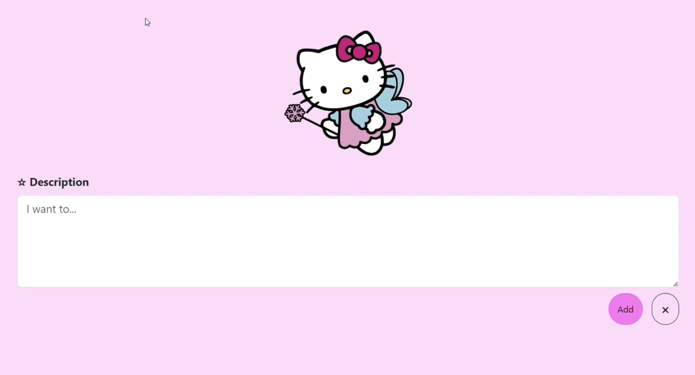

# Flask ToDo App

## Description

This project is a simple ToDo web application built with Flask, designed to help users manage their tasks efficiently.  

## Features

- **Add Tasks**: Users can create new tasks and add them to their ToDo list.
- **Edit Tasks**: Modify existing tasks to update their descriptions.
- **Delete Tasks**: Remove tasks from the list that are no longer needed.
- **Mark as Done/Undone**: Track the completion status of tasks by marking them as done or undone.
- **Responsive Design**: The application is styled using Bootstrap for a responsive and visually appealing interface.

## Technologies Used

- **Flask**: A lightweight Python web framework.
- **SQLAlchemy**: An ORM for managing database interactions.
- **Bootstrap**: A front-end framework for responsive design.
- **HTML/CSS**: Core technologies for web development.

## App in Action

